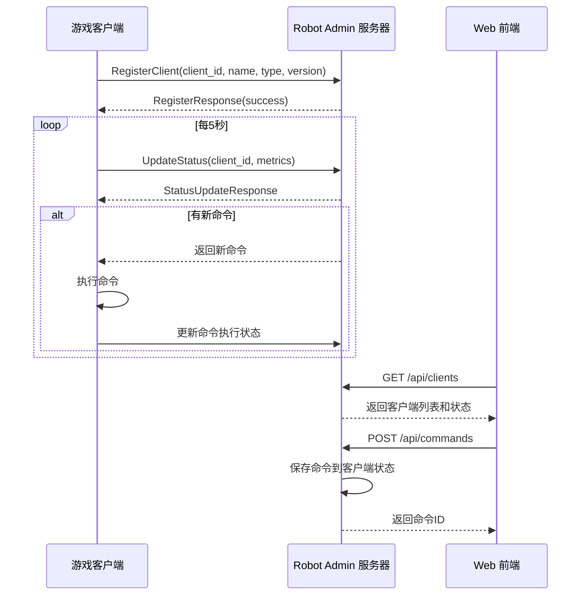
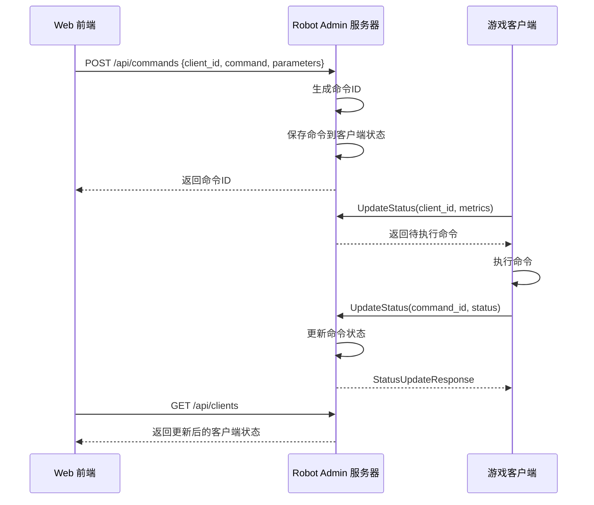

# Robot Admin 系统序列图

## 客户端注册和状态更新流程

## 命令执行流程

## 组件交互说明

1. **客户端注册流程**
   - 客户端启动时向服务器注册
   - 提供客户端ID、名称、类型和版本信息
   - 服务器确认注册并保存客户端信息

2. **状态更新机制**
   - 客户端每5秒向服务器发送一次状态更新
   - 更新包含：
     - 客户端指标（CPU、内存等）
     - 当前命令执行状态（如果有）
   - 服务器通过状态更新响应下发新命令

3. **命令执行流程**
   - Web前端发送命令到服务器
   - 服务器保存命令到对应客户端的状态
   - 客户端在下次状态更新时接收命令
   - 客户端执行命令并报告执行状态
   - Web前端通过轮询获取最新状态

4. **错误处理**
   - 客户端连接断开时自动重连
   - 命令执行失败时报告错误状态
   - 服务器保持命令状态直到确认完成或失败
